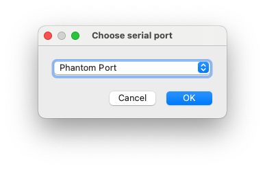
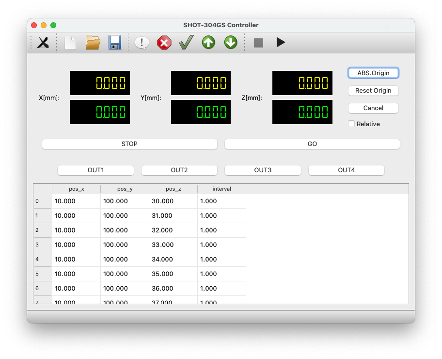

# shotControl
Control application for SHOT-304GS

## Required python modules
+ PyQt5
+ PySerial

## Serial Port
This application does not supported the USB driver provided by SIGMA Ltd.
Instead of that, serial connection is only suppored by this application.
Various USB - RS-232C converter devices are applicable for most of modern PC
to connect USB port to the RS-232C port on SHOT-304GS.

## Usage
type following from terminal 
```sh
$ python shotControl.py
```
`$` represents the shell prompt depending on your environment.

An optional argument `-v` or `--verbose` is acceptable.
The script writes out various information to the terminal (standard output).

Further information of optional arguments will be shown by `-h` or `--help` option.

### Serial port selection


Available serial ports are listed in drop down menu.
***Phantom Port*** is dummy port for check the sequence.

Press ***OK*** to proceed to the main window, or ***Cancel*** to quit immediately.


### Main window



# miniterm での通信

```
python -m serial.tools.miniterm -e --eol CRLF /dev/cu.usbserial-AI05GTL2
```

# git のメモ
## リモートリポジトリを初めて取得するとき

研究室用 gitbucket サーバから
```sh
$ git clone http://fornax.ee.tokushima-u.ac.jp:8080/git/C-4_OpenLab/shotControl.git
```

githubから
```sh
$ git clone https://github.com/makutaga/shotControl.git
```

## リモートリポジトリの更新をローカルリポジトリに反映させるとき
```sh
$ git pull
```

## ローカルリポジトリの更新をリモートリポジトリに反映させるとき
```sh
$ git pull
$ git push
```

## ファイルの更新状況をローカルリポジトリと比較する
```sh
$ git status
```

## ファイルの更新をローカルリポジトリに反映させる
```sh
$ git add shotControl.py    <-- 更新したファイルを並べる
$ git commit                <-- コメント入力画面になる。更新内容に関する記述など。
```
リモートリポジトリに反映させる場合は続いて別項目の操作をする。


## リモートリポジトリの切り替え
複数のリモートリポジトリを使っているとき。

例えば `copy`から`origin`に切り替えるとする。
ブランチは`main`。

リモートリポジトリの確認
```sh
$ git remote -v
copy	http://fornax.ee.tokushima-u.ac.jp:8080/git/C-4_OpenLab/shotControl.git (fetch)
copy	http://fornax.ee.tokushima-u.ac.jp:8080/git/C-4_OpenLab/shotControl.git (push)
origin	https://github.com/makutaga/shotControl.git (fetch)
origin	https://github.com/makutaga/shotControl.git (push)
```
こちらでも良い
```sh
$ git remote show
copy
origin
```

`-u`オプション（`--set-upstream`オプション）を使って，`push` + 切り替え
```sh
$ git -u origin main
```
`origin` がリモートリポジトリ名，`main`はブランチ名。ブランチ名は省略できる。
`-u`をつけなければ`push`のみ。


